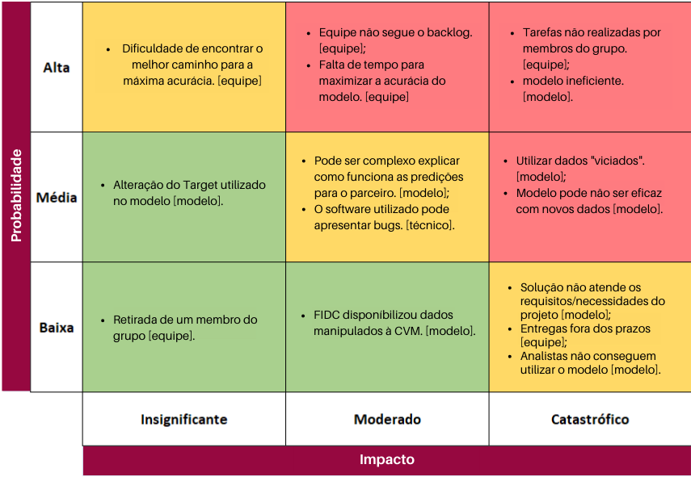
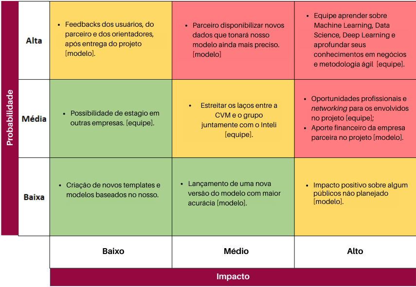
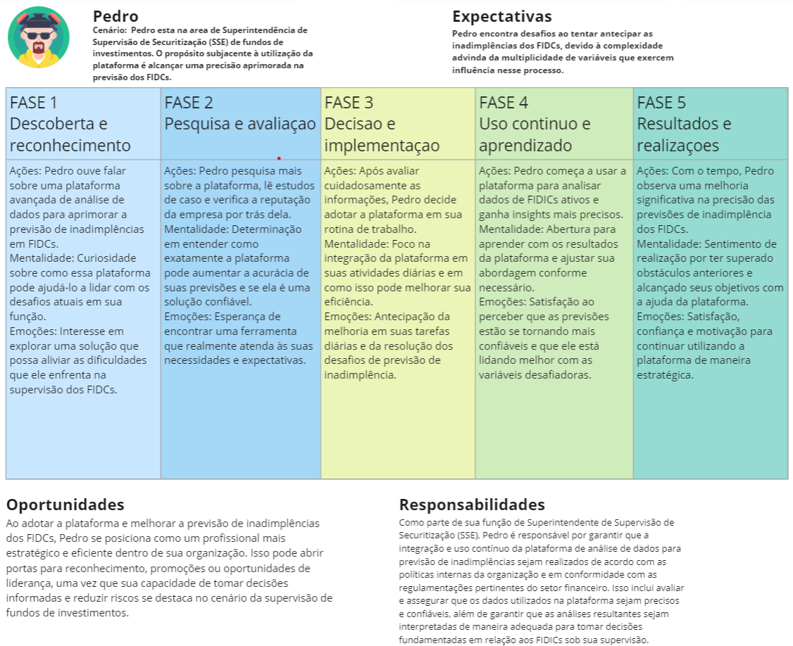
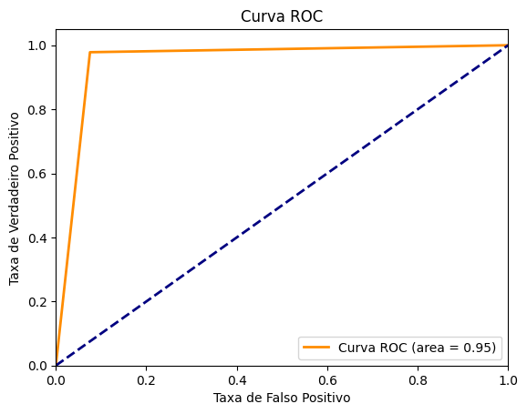
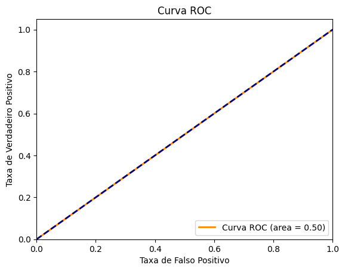
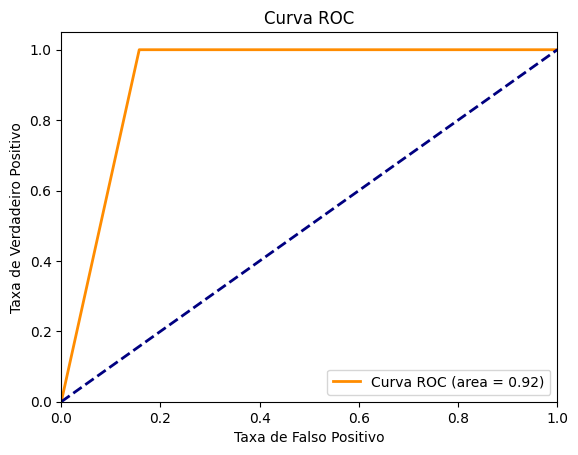

# Documentação Modelo Preditivo - Inteli

## PoulVision
### POUL
#### Felipe Liberman Fuchs, Filipe Kanazawa Calabro, João Cauê Hirata Machado, Marcelo Miguel Pereira de Assis, Moyses Birman Anijar, Pedro Auler de Barros Martins, Raul Rezende Szpak

## Sumário
[1. Introdução](#c1)

[2. Objetivos e Justificativa](#c2)

[3. Metodologia](#c3)

[4. Desenvolvimento e Resultados](#c4)

[5. Conclusões e Recomendações](#c5)

[6. Referências](#c6)

## <a name="c1"></a>1. Introdução
&emsp;&emsp;A Comissão de Valores Mobiliários (CVM) é uma autarquia federal brasileira fundada em 7 de dezembro de 1976, durante um período de dramáticas mudanças econômicas e políticas no Brasil. A CVM foi criada para regular, fiscalizar e incentivar o mercado de valores mobiliários, desempenhando um papel vital na proteção dos investidores e no aumento da transparência e eficiência do mercado de capital.

&emsp;&emsp;Suas origens remontam à década de 1970, quando a necessidade de estabelecer regras e fiscalizar as operações com valores mobiliários tornou-se fundamental. Nascida em um contexto histórico marcado pela ditadura militar, o órgão busca promover uma economia baseada na livre iniciativa, garantir a proteção dos interesses dos investidores e estimular o crescimento dos negócios por meio do mercado de capital.

&emsp;&emsp;Com sede localizada no Rio de Janeiro, a comissão tem jurisdição nacional e atua de forma independente; ela possui porte expressivo, que contêm um corpo técnico profissional e qualificado para facilitar a supervisão e regulamentação do mercado.

&emsp;&emsp;No cenário financeiro brasileiro, a CVM é considerada a principal entidade fiscalizadora, tendo autoridade e representatividade no mercado de capitais. Sua atuação é essencial para garantir a confiança dos investidores, promover a eficiência e a liquidez do mercado, além de zelar pelo cumprimento das regras e normas que regem à indústria de valores mobiliários no país, contribuindo significativamente para o desenvolvimento econômico do Brasil.

&emsp;&emsp;Dentro desse contexto, os Fundos de Investimento em Direitos Creditórios (FIDCs) surgem como veículos de investimento que detêm créditos provenientes de diversos ativos. No entanto, os FIDCs enfrentam desafios significativos relacionados à falta ou insuficiência de provisões para cobrir possíveis inadimplências nos créditos que compõem o fundo, resultando em perdas não previstas para os investidores. A ausência de reservas financeiras deixa o fundo desprotegido, enquanto provisões insuficientes não conseguem compensar as inadimplências reais, o que pode levar a transferências indesejadas de riqueza entre os cotistas. A gestão eficaz de riscos e a supervisão da CVM são essenciais para proteger os interesses dos investidores, especialmente após a abertura dos FIDCs para investidores de varejo.

## <a name="c2"></a>2. Objetivos e Justificativa
### 2.1 Objetivos
&emsp;&emsp;A CVM tem como objetivo fiscalizar a Provisão para Perdas de FIDCs para evitar a transferência de riqueza entre cotistas dos fundos. Alinhado com este objetivo, este projeto pretende agilizar e melhorar a precisão da análise dessas provisões através de algorítmos de processamento de dados e Inteligência Artificial.

### 2.2 Proposta de solução
&emsp;&emsp;Para cumprir o objetivo acima, será utilizada a biblioteca Pandas para processar e organizar os dados, usando a mesma para aplicar a fórmula _target_:

> (VR DCs com Riscos e Benefícios + VR DCs sem Riscos e Benefícios) / Patrimônio Líquido

&emsp;&emsp;Com isso, serão testados alguns algorítmos para prever os resultados com base nos dados, e será estabelecida uma metodologia com base em métricas de precisão e exatidão.

&emsp;&emsp;Tendo estabelecido uma metodologia de análise com os algortimos mais precisos, será disponibilizado um `script` para tratar os dados sob-demanda, com um notebook do google colab, utilizando do pyplot para formar gráficos, permitindo a visualização dos dados pela equipe da CVM.

### 2.3 Justificativa
&emsp;&emsp;A solução descrita anteriormente permite que seja conduzida uma análise exploratória dos dados de forma iterativa, com o objetivo de testar e comparar vários algorítmos para atendar à demanda da CVM.

&emsp;&emsp;O formato de `script` foi escolhido por permitir que a CVM aplique a metodologia desenvolvida neste projeto de forma recorrente, sem depender de uma equipe de tratamentos de dados. Com isso, será possível alimentar um dashboard em PowerBi conforme necessário, trazendo agilidade ao dia-a-dia do órgão.

## <a name="c3"></a>3. Metodologia

&emsp;&emsp;O CRISP-DM, que significa Cross-Industry Standard Process for Data Mining, é um processo amplamente adotado na orientação de projetos de mineração e análise de dados. Ele divide o ciclo de vida de um projeto de exploração de dados em seis fases distintas, cada uma desempenhando um papel fundamental no sucesso do projeto, conforme descrito no artigo do blog "CRISP-DM: As 6 Etapas da Metodologia do Futuro"[<a href="#ref1">1</a>]. Cada etapa pode ser visualizada abaixo:

**1. Compreensão do Negócio:**

&emsp;&emsp;Nesta fase inicial, o foco está em entender profundamente o contexto do problema de negócios. Isso envolve conversas com os stakeholders para identificar os objetivos do projeto, suas necessidades e expectativas. Para ajudar a direcionar o projeto e definir critérios de sucesso claros, é crucial estabelecer claramente o que a empresa deseja alcançar com a exploração dos dados.

**2. Compreensão dos Dados:**

&emsp;&emsp;Após estabelecer os objetivos de negócios, a equipe se concentra em coletar e explorar os dados disponíveis. Uma análise inicial dos dados é realizada para avaliar sua qualidade, estrutura e significado, além de entender os dados de acordo com o contexto do projeto.

**3. Preparação dos Dados:**

&emsp;&emsp;Essa fase envolve a limpeza dos dados, o que inclui o tratamento de valores ausentes, assim como o de outliers e a transformação e codificação dos dados, bem como a seleção das características (features) mais relevantes. O principal objetivo dessa etapa é criar um conjunto de dados adequado para a modelagem. Essa fase costuma ser a mais trabalhosa e cansativa, visto que a integridade dos dados é crucial para um bom modelo preditivo.

**4. Modelagem:**

&emsp;&emsp;Na fase de modelagem, a equipe começa a construir e treinar modelos de machine learning, que envolve a escolha de algoritmos apropriados, como Regressão Logística, Random Forest, Adaboost Classifier, Bagging Classifier e Gradient Boosting. Os modelos são treinados usando o conjunto de dados de treinamento e, em seguida, testados usando os dados de teste e ajustados para otimizar seu desempenho.

**5. Avaliação:**

&emsp;&emsp;Nessa etapa, o desempenho dos modelos é avaliado para determinar o melhor. Isso é feito usando métricas de desempenho, como acurácia, recall, curvas AUC e ROC. Os resultados são comparados com os critérios de sucesso definidos na fase de compreensão do negócio e, se os modelos não atenderem aos critérios, ajustes podem ser feitos, ou a equipe pode optar por voltar às fases anteriores para melhorar os dados ou a modelagem.

**6. Implementação:**

&emsp;&emsp;Finalmente, na fase de implementação, o modelo escolhido é implementado em um ambiente de produção para uso prático. Isso envolve a integração do modelo em sistemas existentes, o desenvolvimento de interfaces de usuário, se necessário, e a configuração do monitoramento contínuo do desempenho do modelo.


## <a name="c4"></a>4. Desenvolvimento e Resultados
### 4.1. Compreensão do Problema
&emsp;&emsp;Ao analisar os problemas associados aos Fundos de Investimento em Direitos Creditórios (FIDCs), um problema central reside na constituição e manutenção adequadas de provisões para perdas. Estas provisões são reservas financeiras essenciais estabelecidas para cobrir potenciais inadimplências nos créditos detidos pelo fundo. A ausência ou insuficiência destas provisões pode causar perdas substanciais e inesperadas para os cotistas do FIDC.

&emsp;&emsp;A ausência de constituição de provisão para perdas ocorre quando o administrador do FIDC não reserva uma quantia de dinheiro para cobrir possíveis inadimplências. Nesta situação, o FIDC está, essencialmente, operando sem um colchão de segurança financeira. Se a inadimplência ocorrer, os cotistas poderiam enfrentar perdas inesperadas que não foram antecipadas nem mitigadas.

&emsp;&emsp;Por outro lado, pode haver situações em que uma provisão para perdas é constituída, mas a quantia reservada não é suficiente para cobrir as inadimplências reais. Neste caso, mesmo que exista uma precaução financeira, ela se mostra insuficiente, o que também pode resultar em perdas inesperadas para os cotistas.

&emsp;&emsp;Em ambos os cenários, a inadequada provisão para perdas pode levar a uma indesejada transferência de riqueza entre os cotistas. Isso ocorre quando alguns cotistas resgatam suas cotas antes de uma perda ser reconhecida pelo fundo, obtendo assim um retorno potencialmente maior do que aqueles que mantêm suas cotas e experimentam uma desvalorização quando a perda é finalmente reconhecida.

&emsp;&emsp;Este problema sublinha a necessidade vital de uma gestão de risco eficaz e transparente nos FIDCs, especialmente considerando a recente abertura destes fundos para investidores de varejo. A supervisão adequada da CVM se torna ainda mais crucial para garantir que os FIDCs sejam gerenciados de maneira adequada e transparente, protegendo os interesses de todos os cotistas.

#### 4.1.1. Contexto da indústria 
&emsp;&emsp;No século XVIII, informação privilegiada era considerada pelas agências reguladoras como a “expressão de ser bem informado”Foi somente depois da crise de 1929, que começaram a surgir diversas denúncias de casos em que funcionários de alto escalão estariam ganhando dinheiro em cima do prejuízo de empresas. Roosevelt, presidente dos Estados Unidos que assumiu em 1933 por meio do New Deal, com ajuda da política Keynesiana, estado maior, conseguiu reestruturar a economia.

&emsp;&emsp;A Comissão dos Valores Mobiliários, teve seus fundamentos inspirados nos Securities Acts, em 1933 e na criação da SEC (Securities and Exchange Commission) em 1934.

&emsp;&emsp;A CMV foi fundada em 1976, pela Lei  n° 6385 com o objetivo de disciplinar, fiscalizar, e desenvolver o mercado de valores mobiliários no Brasil.

&emsp;&emsp;O Brasil acabará de passar por uma crise institucional, causada pelo tamanho e estrutura adquirida na década anterior, aliada à instabilidade econômica pós planos desenvolvimentistas.

&emsp;&emsp;Para trazer mais segurança, e fomentar os mercados mobiliários que a CVM foi criada, em formato de entidade autárquica, obtendo também poderes normativos, judiciários e reguladores.

&emsp;&emsp;Para entender mais deste setor, foram utilizadas 2 ferramentas de análises setoriais:

&emsp;&emsp;As 5 Forças de Porter, e a Matriz Swot.

&emsp;&emsp;Para realizar os estudos via 5 Forças de Porter, é necessário entender:

**1) Quais podem ser os produtos substitutos**

**2) Como é a concorrência?**

**3) Novos entrantes no mercado?**

**4) Negociação com clientes.**

**5) Negociação com fornecedores.**

1) Produtos substitutos:

&emsp;&emsp;A CVM fiscaliza e orienta os participantes dos mercados, e tem como seu principal objetivo o fomento do mercado de capitais. Ela é representada por uma autarquia, e não tem necessariamente um produto substituto; mas, como um de seus objetivos é necessariamente o fomento do mercado Brasileiro, como produto substituto consideraremos outros mercados em outros países para abertura de capital de empresas ou negociações de ativos.

&emsp;&emsp;De 2018 à outubro de 2021, segundo a Economatica em 13/10/2021, 13 empresas principalmente ligadas a tecnologia e financas, decidiram realizar a abertura de seu capital nos Estados Unidos. Isso pode se dar, segundo Flávio de Oliveira, sócio fundador da Zahl Investimentos, em uma entrevista para o Invest News, publicada dia 22 de outubro de 2021 por Fabiana Ortega, por conta de alguns fatores como: 
1.1) Regulamentações mais flexíveis, principalmente relacionadas ao controle da empresa.
1.2) Possibilidade de maior visibilidade estando listada na NASDAQ
1.3) Mais liquides
1.4) Expertise no mercado, muitas vezes pelo fato do Mercado Brasileiro não ser tão desenvolvido como o Norte Americano, as empresas principalmente relacionadas a tecnologia, podem não conseguir defender e sustentar Valuations mais complexos.
1.5) Múltiplos mais altos, que acaba também aumentando o Valuation.
1.6) Mercado Mai’s maduro. Nos Estados Unidos, mais de 50% da população já investe. Aqui no Brasil esse número não passa de 2%.

2) Concorrência: Como a CVM é representada por uma entidade autárquica, não possui concorrentes necessariamente, porém como visto no tópico anterior, podemos entender mercados exteriores como possíveis concorrentes.

3) Novos entrantes no mercado: Com a tecnologia Blockchain, desde 2020 se popularizaram mercados de negociações de ativos de modo descentralizado. Que nem sempre seguem as normas estabelecidas pelas comissões de valores mobiliários ao redor do mundo.
Essas negociações podem acontecer por meio de uma exchange descentralizada, centralizada, ou até mesmo sem nenhum intermediário, via diretamente 2 participantes.
O problema, é que como ocorrem conflitos entre a legislação atual e esses novos entrantes, eles possuem regulação própria, que no caso dependeria de uma maturidade muito maior do investidor para entender e confiar nessas modalidades.

4) Negociação com os clientes: Nesse caso, os clientes podem ser considerados tanto as empresas, quanto fundos e emissores de produtos financeiros, quanto os investidores.
Como a CVM é representada por uma entidade autárquica, o ideal é que não haja negociações que fujam do escopo definido em lei.

5) Negociação com fornecedores: A CVM não possui um fornecedor, pois se trata de uma entidade que regula, fiscaliza, julga entre outros processos.
   
#### 4.1.2. Análise SWOT 
&emsp;&emsp;As 5 forças de Porter, como visto a cima, fornece uma análise mais externa em relação à empresa ou entidade, e seu setor de atuação.

&emsp;&emsp;Já na análise SWOT, teremos uma visão com foco maior na empresa/entidade.

&emsp;&emsp;As análises feitas nessa framework são:
1) Quais são as forças?
2) Quais são as fraquezas?
3) Quais são as oportunidades?
4) Quais são as ameaças?

&emsp;&emsp;As forças no caso da CVM, podem ser representadas por:

&emsp;&emsp;Autoridade regulatória no mercado de capitais, experiência, transparência, tecnologia e infra-estrutura exemplar mundialmente.

Pontos fracos: A CVM por ser uma entidade que tem relações com o governo, pode ter recursos limitados com mais facilidade, pode ser representado pela falta de pessoas nos times. Podendo ocasionar na dificuldade de execução eficiente de suas atividades.
Além disso, complexidade legal pode ser outro ponto fraco, o que pode resultar em desafios na interpretação e implementação de regulamentos.

Oportunidades: Por meio de tecnologia e inovação, a CVM poderá nos próximos anos desenvolver ferramentas que tornem o processo de fiscalização entre outros muito mais robustos, com funcionamentos muito mais simples.
Além de poder se utilizar de programas e inteligências artificiais para evitar fraudes e otimizar processos internos.

Ameaças: Fraudes financeiras e mudanças legislativas podem ser consideradas uma ameaça, pois criam desafios na adaptação dos regulamentos e processos da CVM. Além disso, a rápida evolução do mercado (podendo ser representada pela resolução CVM 175) pode ser uma ameaça caso cresça muito a demanda por trabalho, fiscalização entre outros, enquanto o escopo profissional permanece constante.

#### 4.1.3. Planejamento Geral da Solução
**Dados Disponíveis:**
&emsp;&emsp;Os dados disponíveis para o projeto são relacionados aos Fundos de Investimento em Direitos Creditórios (FIDCs) que incluem informações detalhadas sobre os ativos, créditos, provisões, inadimplências, riscos e benefícios associados aos fundos. Os dados são provenientes de informes mensais obtidos por meio da Comissão de Valores Mobiliários (CVM).

**Solução Proposta:**
&emsp;&emsp;A solução visa avaliar e prever o desempenho dos FIDCs por meio da análise quantitativa e com a utilização de algoritmos de previsão. A métrica de desempenho será calculada utilizando a fórmula target:

> (VR DCs com Riscos e Benefícios + VR DCs sem Riscos e Benefícios) / Patrimônio Líquido

&emsp;&emsp;Algoritmos serão testados para prever resultados com base nessa métrica, utilizando uma metodologia que prioriza a precisão e a exatidão.

**Tipo de Tarefa:** A tarefa envolve principalmente regressão, pois o objetivo é prever um valor numérico (métrica de desempenho dos FIDCs) com base em dados históricos.

**Utilização da Solução:** A solução proposta será utilizada pela CVM para avaliar o desempenho dos FIDCs a fim de prever tendências futuras. Os dados dos FIDCs serão processados e organizados utilizando a biblioteca Pandas e a fórmula target será aplicada para calcular a métrica de desempenho. Será disponibilizado um script que tratará os dados sob demanda, utilizando um notebook do Google Colab, e que também utilizará da biblioteca pyplot para criar gráficos que permitam a visualização dos resultados, facilitando o trabalho dos analistas da CVM.

**Benefícios da Solução Proposta:** A solução proposta traz diversos benefícios para a CVM e para os investidores, ela oferece uma abordagem baseada em dados para avaliar o desempenho dos FIDCs, permitindo a identificação antecipada de possíveis inadimplências e riscos. Isso contribui para a tomada de decisões, protege os interesses dos investidores e melhora a transparência e eficiência do mercado de capitais.

**Critério de Sucesso e Métrica de Avaliação:** O critério de sucesso da solução será a capacidade de prever com precisão o desempenho dos FIDCs. A métrica de avaliação será a precisão dos algoritmos de previsão, medida pela diferença entre os valores previstos e os valores reais da métrica de desempenho dos FIDCs. Quanto menor for essa diferença, maior será a precisão da solução. A criação de gráficos interativos usando a biblioteca pyplot também será considerada um indicador de sucesso na implementação da solução.

#### 4.1.4. Value Proposition Canvas

<div align="center">
  <p><strong>Imagem 1:</strong> Value Proposition Canvas</p>
  
  <p>Fonte: <em>Elaborado pelos próprios autores</em></p>
</div>

#### 4.1.5.1 Matriz de Riscos
<p>A Matriz de Riscos, exibida na Imagem 2, tem como função principal indicar quais são os possíveis riscos para este projeto, assim como os impactos de cada risco, de modo que seja possível evitá-los ou amenizá-los. Todavia, caso eles venham a se concretizar, é possível contorná-los mais facilmente, devido ao plano de ação desenvolvido sobre a matriz.</p>
.
<div align="center">
  <p><strong>Imagem 2:</strong> Matriz de Riscos</p>
  
  <p>Fonte: <em>Elaborado pelos próprios autores</em></p>
</div>

<h3>Plano de ação</h3>

**Risco: Dificuldade de encontrar o melhor caminho para a máxima acurácia [equipe].**

&emsp;&emsp;Plano:
- Realizar reuniões para avaliar abordagens.
- Identificar métodos eficazes para otimização.
- Selecionar a melhor estratégia com a equipe.

**Risco: Equipe não segue o backlog.**

&emsp;&emsp;Plano:
- Seguir os frameworks Scrum ou Kanban.
- Realizar a daily.
- Priorizar tarefas e ajustar conforme necessário.

**Risco: Falta de tempo para maximizar a acurácia do modelo.**

&emsp;&emsp;Plano:
- Avaliar o escopo do projeto e requisitos.
- Definir marcos e prazos alcançáveis.
- Considerar tempo para revisões e ajustes.

**Risco: Tarefas não realizadas por membros do grupo.**

&emsp;&emsp;Plano:
- Acompanhar tarefas atribuídas a cada membro.
- Oferecer suporte para remover obstáculos.
- Manter uma cultura de colaboração.

**Risco: Modelo ineficiente.**

&emsp;&emsp;Plano:
- Realizar análises periódicas de desempenho.
- Experimentar diferentes configurações.
- Incorporar feedback da equipe.

**Risco: Alteração do Target utilizado no modelo.**

&emsp;&emsp;Plano:
- Implementar revisões por pares.
- Avaliar o impacto nas previsões.
- Assegurar consenso das partes interessadas.

**Risco: Pode ser complexo explicar como funciona as predições para o parceiro.**

&emsp;&emsp;Plano:
- Criar visualizações simples e informativas.
- Utilizar exemplos compreensíveis.
- Oferecer sessões de explicação detalhadas.

**Risco: O software utilizado pode apresentar bugs.**

&emsp;&emsp;Plano:
- Realizar testes de unidade e integração.
- Criar testes abrangentes de aceitação.
- Corrigir bugs antes da implementação.

**Risco: Utilizar dados "viciados".**

&emsp;&emsp;Plano:
- Aplicar técnicas de pré-processamento.
- Validar fontes de dados independentes.

**Risco: Modelo pode não ser eficaz com novos dados.**

&emsp;&emsp;Plano:

- Adotar abordagens adaptativas.
- Considerar diferentes tipos de dados.
- Manter a capacidade de reconfiguração.

**Risco: Retirada de um membro do grupo.**

&emsp;&emsp;Plano:
-Documentar funções e responsabilidades.
-Preparar-se para imprevistos.

**Risco: FIDC disponibilizou dados manipulados à CVM.**

&emsp;&emsp;Plano:
- Avisar a CVM sobre o fato
- Tirar os Dados manipulados da análise

**Risco: Solução não atende os requisitos/necessidades do projeto.**

&emsp;&emsp;Plano:
- Realizar revisões regulares com partes interessadas.
- Atualizar sobre o progresso e desafios.
- Incorporar feedback para melhorias contínuas.

**Risco: Entregas fora dos prazos.**

&emsp;&emsp;Plano:

- Definir metas intermediárias mensuráveis.
- Monitorar o progresso em relação aos marcos.
- Ser flexível para adaptar os prazos conforme necessário.

**Risco: Analistas não conseguem utilizar o modelo.**

&emsp;&emsp;Plano:
- Criar tutoriais detalhados sobre o uso do modelo.
- Fornecer recursos para consulta contínua.

#### 4.1.5.2 Matriz de Oportunidades
<p>A Matriz de Oportunidades, na Imagem 3, tem como função principal indicar quais são as possíveis oportunidades para este projeto, assim como os impactos de cada oportunidade, de modo que seja possível aproveitá-las.</p>
<div align="center">
  <p><strong>Imagem 3:</strong> Matriz de Oportunidades</p>
  
  <p>Fonte: <em>Elaborado pelos próprios autores</em></p>
</div>

#### 4.1.6. Personas
&emsp;&emsp;Pedro é um analista da Superintendencia de Supervisão de Securitização (SSE) de fundos de investimento em São Paulo. Tem 36 anos, ele é casado e tem filhos. Em sua função, Pedro lida com uma vasta quantidade de dados, o que aguçou seu pensamento lógico e racional. Ele busca, através da plataforma, aumentar a precisão das predições dos FIDCs (Fundo de Investimento em Direitos Creditórios). Com a nova lei que permite investidores não necessariamente qualificados a investir em FIDCs, Pedro encontra desafios em monitorar as provisões do crescente número de FIDCs ativos. A supervisão se torna ainda mais complexa devido ao volume de dados e às diversas variáveis que afetam a previsão de inadimplências.

#### 4.1.7. Jornadas do Usuário


<div align="center">
  <p><strong>Imagem 4:</strong> Jornada do Usuário</p>
  
  <p>Fonte: <em>Elaborado pelos próprios autores. </em>[Clique aqui para ver o mapa de jornada no Miro](https://miro.com/app/board/uXjVMvG4L30=/)</p>
</div>

#### 4.1.8 Política de Privacidade
```
# POLÍTICA DE PRIVACIDADE DO POUL
(última modificação: 9 de agosto de 2023)

&emsp;&emsp;Esta Política de Privacidade rege o seu uso do repositório Poul ("Script") criado pelo grupo 2 da Turma 10 do Inteli.

## Introdução

&emsp;&emsp;Este script é fornecido pelo grupo 2 da Turma 10 do Inteli. Nesta Política de Privacidade, "Você", "Seu(s)" ou "Sua(s)" referem-se a qualquer tipo de usuário deste script e "Nós", "Nos" ou "Nosso(s)" referem-se ao grupo 2 da Turma 10 do Inteli.

&emsp;&emsp;Sua privacidade é importante para nós. Esta Política de Privacidade explica nossas práticas com relação à coleta, ao uso, ao tratamento e à divulgação de informações que Você possa fornecer por meio deste Script.

&emsp;&emsp;Leia toda esta Política de Privacidade antes de usar ou enviar informações para este Script.

&emsp;&emsp;Esta Política de Privacidade se aplica somente aos dados coletados por meio deste Script.

## Sua aceitação desta Política de Privacidade

&emsp;&emsp;Ao usar este Script, você concorda com os termos desta Política de Privacidade. Sempre que processar informações por meio deste Script, Você declara estar ciente da coleta, do uso, do tratamento e da divulgação dessas informações de acordo com esta Política de Privacidade.

## Coleta Ativa de Informações

&emsp;&emsp;Nós não recebemos ou armazenamos nenhum tipo de informação que você processa por meio deste Script.

## Uso de Informações

&emsp;&emsp;Não podemos usar Seus Dados Pessoais para nenhuma finalidade

## Divulgação de Informações

&emsp;&emsp;Em nenhuma circunstância alugaremos ou venderemos seus dados pessoais a terceiros.

## Como Entrar em Contato com Nosso Diretor de Proteção de Dados

&emsp;&emsp;Em caso de dúvidas, comentários ou preocupações sobre esta Política de Privacidade ou sobre as práticas de informação deste Script, Você poderá entrar em contato com nosso responsável pela proteção de dados em nosso Serviço de Atendimento ao Cliente:
[incluir detalhes]

## Alterações nesta Política de Privacidade

&emsp;&emsp;De tempos em tempos, a Nosso critério exclusivo, poderemos alterar ou modificar esta Política de Privacidade. A qualquer momento, Seu acesso e uso deste Script e o fornecimento de informações serão regidos pela Política de Privacidade então vigente. Você será notificado sobre alterações materiais a esta Política de Privacidade por meio de um aviso para o endereço de e-mail ou número de telefone que Você nos forneceu ou um aviso em destaque em nosso repositório.
```


### 4.2. Compreensão dos Dados

#### 4.2.1. Exploração de dados

&emsp;&emsp;Para melhor visualização dos dados, selecionamos apenas 35 das 336 colunas iniciais. Algumas colunas que continham prazo, como por exemplo "Carteira_Direitos_Aquisicao_Inadimplentes_1_30_Dias", foram somadas em novas colunas agrupadas por prazo, sendo CP (curto prazo: 1 a 90 dias), MP (médio prazo: 91 a 360 dias) e LP (longo prazo: acima de 361 dias). As features selecionadas foram separadas em dois grupos, colunas numéricas e colunas categóricas.

&emsp;&emsp;Colunas numéricas:
- `Carteira_Direitos_Aquisicao_Prazo_CP`,
- `Carteira_Direitos_Aquisicao_Prazo_MP`,
- `Carteira_Direitos_Aquisicao_Prazo_LP`,
- `Carteira_Direitos_Aquisicao_Inadimplentes_CP`,
- `Carteira_Direitos_Aquisicao_Inadimplentes_MP`,
- `Carteira_Direitos_Aquisicao_Inadimplentes_LP`,
- `Carteira_Direitos_Aquisicao_Pagos_CP`,
- `Carteira_Direitos_Aquisicao_Pagos_MP`,
- `Carteira_Direitos_Aquisicao_Pagos_LP`,
- `Carteira_Direitos_Sem_Aquisicao_Prazo_CP`,
- `Carteira_Direitos_Sem_Aquisicao_Prazo_MP`,
- `Carteira_Direitos_Sem_Aquisicao_Prazo_LP`,
- `Carteira_Direitos_Sem_Aquisicao_Inadimplentes_CP`,
- `Carteira_Direitos_Sem_Aquisicao_Inadimplentes_MP`,
- `Carteira_Direitos_Sem_Aquisicao_Inadimplentes_LP`,
- `Carteira_Direitos_Sem_Aquisicao_Pagos_CP`,
- `Carteira_Direitos_Sem_Aquisicao_Pagos_MP`,
- `Carteira_Direitos_Sem_Aquisicao_Pagos_LP`,
- `Liquidez_CP`,
- `Liquidez_MP`,
- `Liquidez_LP`,
- `Carteira_Financeiro`,
- `Valor_Total_Captado`,
- `Valor_Total_Resgates`,
- `Valor_A_Pagar`,
- `Valor_Total_Amortizacao`,
- `Desempenho_Esperado`,
- `Desempenho_Realizado`,
- `Provisao`

&emsp;&emsp;Colunas categóricas:
- `ID_Documento`,
- `CNPJ`,
- `Data_Competencia`,
- `CNPJ_Administrador`,
- `Nome_Administrador`,
- `Forma_Condominio`

&emsp;&emsp;A Tabela 1 possui uma análise descritiva detalhada de cada uma das colunas numéricas, apresentando a média, o desvio padrão, a mediana e os valores máximos e mínimos encontrados em cada uma das colunas.

<div align="center">
  <p><strong>Tabela 1:</strong> Análise Descritiva</p>
  
  <p>Fonte: <em>Elaborado pelos próprios autores</em></p>
</div>

&emsp;&emsp;A fim de visualizar a relação das features escolhidas com o problema, primeiro foi feito uma matriz de correlação entre todas as colunas numéricas selecionadas, disponível no Gráfico 1:

<div align="center">
  <p><strong>Gráfico 1:</strong> Matriz de Correlação Colunas Numéricas</p>
  
  <p>Fonte: <em>Elaborado pelos próprios autores</em></p>
</div>

&emsp;&emsp;Analisando a matriz de correlação entre essas colunas específicas, conseguimos tirar algumas conclusões que, por mais que pareçam obvias, são importantes para a nossa análise á fim de averiguarmos a existência de dados inconsistentes. Uma dessas conclusões é a relação entre a liquidez de um fundo e o valor que esse fundo tem a receber dentro de um prazo (CP, MP e LG). A relação proporcional entre essas features se dá pelo simples motivo que se o valor que um fundo tem a receber dentro de um período aumenta, por consequência, a liquidez do fundo também aumenta. O Gráfico 2 ilustra essa relação entre os dados, onde é possível enxergar uma maior interferência na liquidez do FIDC nos valores dos fundos sem riscos e benefícios (principalmente a curto prazo).

<div align="center">
  <p><strong>Gráfico 2:</strong> Relação das Features por Prazo</p>
  
  <p>Fonte: <em>Elaborado pelos próprios autores</em></p>
</div>

&emsp;&emsp;Outra importante análise que é retirada da matriz de correlação entre as colunas e será aprofundada mais a frente, é a relação entre a inadimplência dos fundos com riscos e benefícos e a provisão de um fundo. No Gráfico 3, foram plotadas separadas as inadimplências a curto, médio e longo prazo em relação com a provisão.

<div align="center">
  <p><strong>Gráfico 3:</strong> Relação Inadimplência e Provisão</p>
  
  <p>Fonte: <em>Elaborado pelos próprios autores</em></p>
</div>

#### 4.2.2. Pré-processamento dos dados

&emsp;&emsp;O pré-processamento dos dados occoreu de maneira iterativa: ao passo que as hipóteses se tornaram cada vez mais complexas,
a limpeza dos dados também aumentou. Desta maneira, foi estabelecida a seguinta metodologia:

##### Passo 1: Agregamento das Cotas
&emsp;&emsp;Alguns fundos contavam com mais de 8 tipos de cotas indicadas pela coluna `Classe_Serie` do dataset. Os valores desta coluna coluna sempre seguem o padrão `Tipo_Número` (ex. `Suboridanada_7`, `Senior_3`). Dito isso, as colunas abaixo foram somadas sendo as cotas Sênior somadas às outras cotas Sênior, e as Subordinadas às Subordinadas:

- `Numero_Cotistas`
- `Quantidade_Cotas`
- `Valor_Cota`
- `Rentabilidade`
- `Valor_Total_Captado`
- `Quantidade_Cotas_Emitidas`
- `Valor_Total_Resgates`
- `Quantidade_Cotas_Resgatadas`
- `Valor_A_Pagar`
- `Quantidade_Cotas_A_Resgatar`
- `Valor_Amortizado_Cota`
- `Valor_Total_Amortizacao`
- `Desempenho_Esperado`
- `Desempenho_Realizado`

##### Passo 2: Agregamento das Colunas por Prazo
&emsp;&emsp;Originalmente, o dataset agregava as informações das carteiras com e sem direito de aquisição pagas, em atraso, ou ainda no prazo, em 10 prazos diferentes:
- 0 a 30 dias
- 31 a 60 dias
- 61 a 90 dias
- 91 a 120 dias
- 121 a 150 dias
- 151 a 180 dias
- 181 a 360 dias
- 361 a 720 dias
- 720 a 1080 dias
- 1080 dias em diante

&emsp;&emsp;Porém, para esta análise, não se faz necessária tamanha granularidade; então, todas as colunas envolvendo prazos foram agregadas em Curto Prazo (0 a 90 dias), Médio Prazo (90 a 360 dias), e Longo Prazo (mais de 360 dias)resultando nas colunas a seguir:

- `Carteira_Direitos_Aquisicao_Prazo_CP`
- `Carteira_Direitos_Aquisicao_Prazo_MP`
- `Carteira_Direitos_Aquisicao_Prazo_LP`
- `Carteira_Direitos_Aquisicao_Inadimplentes_CP`
- `Carteira_Direitos_Aquisicao_Inadimplentes_MP`
- `Carteira_Direitos_Aquisicao_Inadimplentes_LP`
- `Carteira_Direitos_Aquisicao_Pagos_CP`
- `Carteira_Direitos_Aquisicao_Pagos_MP`
- `Carteira_Direitos_Aquisicao_Pagos_LP`
- `Carteira_Direitos_Sem_Aquisicao_Prazo_CP`
- `Carteira_Direitos_Sem_Aquisicao_Prazo_MP`
- `Carteira_Direitos_Sem_Aquisicao_Prazo_LP`
- `Carteira_Direitos_Sem_Aquisicao_Inadimplentes_CP`
- `Carteira_Direitos_Sem_Aquisicao_Inadimplentes_MP`
- `Carteira_Direitos_Sem_Aquisicao_Inadimplentes_LP`
- `Carteira_Direitos_Sem_Aquisicao_Pagos_CP`
- `Carteira_Direitos_Sem_Aquisicao_Pagos_MP`
- `Carteira_Direitos_Sem_Aquisicao_Pagos_LP`
- `Liquidez_CP`
- `Liquidez_MP`
- `Liquidez_LP`


##### Passo 3: Remoção de Colunas onde todos os valores são iguais
&emsp;&emsp;Dados que nunca variam em se quer 1 fileira não agregam valor à análise feita neste trabalho, desta forma as colunas a seguir foram removidas:
- `Ativo_Direitos_Sem_Aquisicao_Creditos_Performar`
- `Ativo_Direitos_Sem_Aquisicao_Creditos_Empresas_Recuperacao`
- `Ativo_Direitos_Sem_Aquisicao_Creditos_Receitas_Publicas`
- `Ativo_Direitos_Sem_Aquisicao_Creditos_Fator_Risco`
- `Ativo_Coberturas_Prestadas', 'Carteira_Creditos_Tributarios`
- `Carteira_Royalties', 'Taxas_Titulos_Federais_Juros_Venda_Minina`
- `Taxas_Titulos_Federais_Juros_Venda_Maxima`
- `Taxas_CDB_Desconto_Venda_Minina`
- `Taxas_CDB_Desconto_Venda_Media_Ponderada`
- `Taxas_CDB_Desconto_Venda_Maxima', 'Taxas_CDB_Juros_Venda_Minina`
- `Taxas_CDB_Juros_Venda_Media_Ponderada`
- `Taxas_CDB_Juros_Venda_Maxima`


##### Passo 4: Soma de "Outros Ativos"
&emsp;&emsp;Uma das partes mais importantes da análise que será feita neste trabalho é prever a inadimplência. Alguns outros fatores, como garantir que ao menos 50% da carteira seja realmente investida em direitos creditórios também são importantes, mas não é necessário ter todo o detalhamento dos ativos não-creditórios dos FIDCs. Tendo isso em mente, as seguintes colunas foram somadas à coluna `Ativos_Outros` e removidas do dataset:

- `Ativo_Valores_Mobiliarios`
- `Ativo_Titulos_Federais`
- `Ativo_CDB`
- `Ativo_Operacoes_Compromissadas`
- `Ativo_Outros_Ativos_Renda_Fixa`
- `Ativo_Cotas_FIDC`
- `Ativo_Warrants`
- `Ativo_Posicao_Derivativos`
- `Ativo_Mercado_Termo`
- `Ativo_Mercado_Opcoes`
- `Ativo_Mercado_Futuro`
- `Ativo_Diferencial_Swap`
- `Ativo_Depositos_Margem`
- `Ativo_Debentures`
- `Ativo_CRI`
- `Ativo_Notas_Promissorias`
- `Ativo_Letras Financeiras`
- `Ativo_Cotas_Fundos_ICVM_555`
- `Ativo_Outros_Valores_Mobiliarios`
- `Ativo_Cotas_FIDC_NP`
- `Ativo_Provisao_Debentures_CRI_NP_LF`
- `Ativo_Provisao_Cotas_FIDC`
- `Ativo_Provisao_Outros_Ativos`

##### Passo 5: Manter apenas as colunas relevantes para as hipóteses
&emsp;&emsp;Tendo em vista o processo iterativo feito para chegar às hipóteses, todas as colunas exceto aquelas listadas a seguir foram removidas do dataset:

- `CNPJ`
- `Data_Competencia`
- `Patrimonio_Liquido`
- `CNPJ_Administrador`
- `Forma_Condominio`
- `Carteira_Direitos_Aquisicao_Inadimplentes_CP`
- `Carteira_Direitos_Aquisicao_Inadimplentes_MP`
- `Carteira_Direitos_Aquisicao_Inadimplentes_LP`
- `Carteira_Direitos_Sem_Aquisicao_Inadimplentes_CP`
- `Carteira_Direitos_Sem_Aquisicao_Inadimplentes_MP`
- `Carteira_Direitos_Sem_Aquisicao_Inadimplentes_LP`
- `Liquidez_CP`
- `Liquidez_MP`
- `Liquidez_LP`
- `Carteira_Financeiro`
- `Provisao`
- `Quantidade_Cotas_Senior`
- `Valor_Cota_Senior`
- `Rentabilidade_Senior`
- `Valor_Total_Captado_Senior`
- `Valor_Total_Resgates_Senior`
- `Valor_A_Pagar_Senior`
- `Quantidade_Cotas_A_Resgatar_Senior`
- `Valor_Amortizado_Cota_Senior`
- `Valor_Total_Amortizacao_Senior`
- `Desempenho_Esperado_Senior`
- `Desempenho_Realizado_Senior`
- `Quantidade_Cotas_Subordinada`
- `Valor_Cota_Subordinada`
- `Rentabilidade_Subordinada`
- `Valor_Total_Captado_Subordinada`
- `Valor_Total_Resgates_Subordinada`
- `Valor_A_Pagar_Subordinada`
- `Quantidade_Cotas_A_Resgatar_Subordinada`
- `Valor_Amortizado_Cota_Subordinada`
- `Valor_Total_Amortizacao_Subordinada`
- `Desempenho_Esperado_Subordinada`
- `Desempenho_Realizado_Subordinada`

#### 4.2.3. Hipóteses

#### Hipótese 1:

&emsp;&emsp;Nossa primeira hipótese [<a href="#ref2">2</a>] sugere uma ligação entre a inadimplência de um FIDC e a sua provisão, definindo um cenário em que a aproximação ou ultrapassagem da inadimplência em relação à provisão pode sinalizar a iminência da quebra desse fundo. Essa hipótese se baseia na ideia de que a provisão tem um papel crucial no abatimento de riscos financeiros, portanto, se um fundo não possui uma provisão adequada para absorver perdas inesperadas causadas pela inadimplência, ele pode rapidamente se encontrar em um estado crítico.

&emsp;&emsp;A fim de provar essa hipótese, primeiramente relacionamos todos os dados que possuíamos sobre a inadimplência com a provisão dos fundos, foi possível perceber que os fundos sem riscos e benefícios praticamente não tinham ligação com a provisão, porém os fundos com riscos e benefícios apresentavam uma boa relação, como demonstrado pelos gráficos 4 e 5.

<div align="center">
  <p><strong>Gráfico 4:</strong> Matriz de correlação entre inadimplência de fundos sem riscos e benefícios e a provisão</p>
  
  <p>Fonte: <em>Elaborado pelos próprios autores</em></p>
</div>

<div align="center">
  <p><strong>Gráfico 5:</strong> Matriz de correlação entre inadimplência de fundos com riscos e benefícios e a provisão</p>
  
  <p>Fonte: <em>Elaborado pelos próprios autores</em></p>
</div>

&emsp;&emsp;Após essa análise, filtramos os fundos presentes nos dados que quebraram ou deram problemas. Ao analisar esses fundos específicos, foram plotados os gráficos 6, 7 e 8, que mostram como se comporta a inadimplência e a provisão do fundo ao longo do tempo: 

<div align="center">
  <p><strong>Gráfico 6:</strong> Gráfico da inadimplência e da provisão ao longo do tempo do fundo "RUBI FUNDO DE INVESTIMENTO EM DIREITOS CREDITÓRIOS MULTISETORIAL"</p>
  
  <p>Fonte: <em>Elaborado pelos próprios autores</em></p>
</div>

<div align="center">
  <p><strong>Gráfico 7:</strong> Gráfico da inadimplência e da provisão ao longo do tempo do fundo "FUNDO DE INVESTIMENTO EM DIREITOS CREDITÓRIOS BULLLA"</p>
  
  <p>Fonte: <em>Elaborado pelos próprios autores</em></p>
</div>

<div align="center">
  <p><strong>Gráfico 8:</strong> Gráfico da inadimplência e da provisão ao longo do tempo do fundo "LS INTERBANK FUNDO DE INVESTIMENTO EM DIREITOS CREDITÓRIOS"</p>
  
  <p>Fonte: <em>Elaborado pelos próprios autores</em></p>
</div>

&emsp;&emsp;Além desses gráficos, alguns outros fundos que também quebraram ou enfrentaram problemas apresentaram gráficos incoerentes. Sendo assim, conseguimos observar uma certa inconsistência nos dados, principalmente ao analisarmos o gráfico do LS INTERBANK FUNDO DE INVESTIMENTO EM DIREITOS CREDITÓRIOS, onde aparentemente, após uma certa data, o fundo não apresenta mais os dados necessários, onde tanto os valores de inadimplência como o da provisão são nulos.

&emsp;&emsp;Analisando os dados de inadimplência e as provisões de uma forma mais geral, pode ser visto no Gráfico 9 que a inadimplência não ultrapassa a provisão em nenhum momento, o que enfraquece a nossa hipótese. Porém comparando com os gráficos de cada fundo que quebraram ou deram problemas, que já foram visualizados acima, é visto que nesses FIDCs específicos, ocorre sim essa variação, pelo menos em algum momento do tempo.

<div align="center">
  <p><strong>Gráfico 9:</strong> Gráfico da inadimplência e da provisão ao longo do tempo</p>
  
  <p>Fonte: <em>Elaborado pelos próprios autores</em></p>
</div>

#### Hipótese 2:

&emsp;&emsp;Nossa segunda hipótese [<a href="#ref3">3</a>] sugere uma ligação entre o aumento da inadimplência durante péridos de crise econômica. A grande relevância dessa hipótese é que em nenhum local do DataSet sugere algo externo aos FIDCs, como uma crise econômica, portanto ao treinar o modelo muito provavelmente ele vai ficar enviesado ao processar dados que não estão de acordo com a realidade atual.

&emsp;&emsp;A fim de provar essa hipótese nos somamos todas as colunas que registram o valor das inadimplências, tanto de CP(Curto Prazo), MP(Medio Prazo) e LP(Longo Prazo) e fizemos a média delas por periodo do ano, e com esses dados processados foi feito o Gráfico 10, que mostra a média geral das inadimplências por periodo do ano.

<div align="center">
  <p><strong>Gráfico 10:</strong> Gráfico da Média da Inadimplência ao Longo do Tempo</p>
  
  <p>Fonte: <em>Elaborado pelos próprios autores</em></p>
</div>

&emsp;&emsp;Portanto com a análise do gráfico fica claro que em perídos de crise econômica, como em 2016 e 2020, houve um drástico aumento na média do valor total das inadimplências, o que não anula nossa hipótese. Sendo assim precisaremos trabalhar em como alinhar os dados com a realidade atual para que nosso modelo preditivo não fique enviesado.

#### Hipótese 3: 
&emsp;&emsp;Nesta terceira hipótese, é possivel explorar como as políticas de concessão de crédito das instituições financeiras afetam a ocorrência de patrimônio líquido zerado. Isso envolveria analisar se instituições que adotam políticas mais flexíveis de concessão de crédito estão mais propensas a enfrentar situações em que seu patrimônio líquido se torna nulo. Você pode considerar fatores como taxas de juros, critérios de avaliação de risco, limites de crédito e outros aspectos das políticas de concessão de crédito.

&emsp;&emsp;Para investigar essa hipótese, deve ser coletado dados relacionados às políticas de concessão de crédito das instituições financeiras no seu conjunto de dados e analisar como esses dados se correlacionam com a ocorrência de patrimônio líquido zerado, como exibido na Imagem 5. Isso pode fornecer insights valiosos sobre como as decisões de crédito podem impactar a estabilidade financeira das instituições.

<div align="center">
  <p><strong>Imagem 5:</strong> Exploração Políticas de Concessão e Patrimônio Líquido Zerado</p>
  
  <p>Fonte: <em>Elaborado pelos próprios autores</em></p>
</div>

### 4.3. Preparação dos Dados e Modelagem

&emsp;&emsp;Primeiramente para o nosso Modelo Supervisionado definimos nosso target, ele é uma coluna binária que identifica se um FIDC está em alerta ou não de acordo com os dados enviados pela CVM informando os FIDCs padronizados que quebraram ao longo do tempo.

&emsp;&emsp;Nome dos FIDCs padronizados que quebraram ao longo do tempo:
- 'FUNDO DE INVESTIMENTO EM DIREITOS CREDITÓRIOS INDIGO BARTER', 
- 'FUNDO DE INVESTIMENTO EM DIREITOS CREDITÓRIOS BRAVA CHALLENGE', 
- 'CREDIHOME FUNDO DE INVESTIMENTO EM DIREITOS CREDITORIOS', 
- 'RUBI FUNDO DE INVESTIMENTO EM DIREITOS CREDITÓRIOS MULTISETORIAL', 
- 'FUNDO DE INVESTIMENTO EM DIREITOS CREDITÓRIOS BULLLA', 
- 'LS INTERBANK FUNDO DE INVESTIMENTO EM DIREITOS CREDITÓRIOS', 
- 'TURQUESA - FUNDO DE INVESTIMENTO EM DIREITOS CREDITÓRIOS'


&emsp;&emsp;Como a coluna foi criada:

```
nomes = ['FUNDO DE INVESTIMENTO EM DIREITOS CREDITÓRIOS INDIGO BARTER', 'FUNDO DE INVESTIMENTO EM DIREITOS CREDITÓRIOS BRAVA CHALLENGE', 'CREDIHOME FUNDO DE INVESTIMENTO  EM DIREITOS CREDITORIOS', 'RUBI FUNDO DE INVESTIMENTO EM DIREITOS CREDITÓRIOS MULTISETORIAL', 'FUNDO DE INVESTIMENTO EM DIREITOS CREDITÓRIOS BULLLA', 'LS INTERBANK FUNDO  DE INVESTIMENTO EM DIREITOS CREDITÓRIOS', 'TURQUESA - FUNDO DE INVESTIMENTO EM DIREITOS CREDITÓRIOS']

 def analisa_nomes(valor):
   for nome in nomes:
     if valor == nome:
       return 1
     else:
       return 0

df['FIDCs_em_alerta'] = df.Nome_Fundo.apply(analisa_nomes)
df['FIDCs_em_alerta'].value_counts()
```

&emsp;&emsp;Após definirmos o target selecionamos a dedo quais features teriam relevância para chegar até ele, sendo assim selecionamos essa colunas:
- `Data_Competencia`, 
- `CNPJ`, 
- `Nome_Fundo`, 
- `CNPJ_Administrador`, 
- `Forma_Condominio`, 
- `Patrimonio_Liquido`, 
- `Carteira_Direitos_Aquisicao_Inadimplentes_CP`, 
- `Carteira_Direitos_Aquisicao_Inadimplentes_MP`, 
- `Carteira_Direitos_Aquisicao_Inadimplentes_LP`, 
- `Carteira_Direitos_Sem_Aquisicao_Inadimplentes_CP`, 
- `Carteira_Direitos_Sem_Aquisicao_Inadimplentes_MP`, 
- `Carteira_Direitos_Sem_Aquisicao_Inadimplentes_LP`, 
- `Liquidez_CP`, 
- `Liquidez_MP`, 
- `Liquidez_LP`, 
- `Carteira_Financeiro`, 
- `Provisao`, 
- `Quantidade_Cotas_Senior`, 
- `Valor_Cota_Senior`, 
- `Rentabilidade_Senior`, 
- `Valor_Total_Captado_Senior`, 
- `Valor_Total_Resgates_Senior`, 
- `Valor_A_Pagar_Senior`, 
- `Quantidade_Cotas_A_Resgatar_Senior`, 
- `Valor_Amortizado_Cota_Senior`, 
- `Valor_Total_Amortizacao_Senior`, 
- `Desempenho_Esperado_Senior`, 
- `Desempenho_Realizado_Senior`, 
- `Quantidade_Cotas_Subordinada`, 
- `Valor_Cota_Subordinada`, 
- `Rentabilidade_Subordinada`, 
- `Valor_Total_Captado_Subordinada`, 
- `Valor_Total_Resgates_Subordinada`, 
- `Valor_A_Pagar_Subordinada`, 
- `Quantidade_Cotas_A_Resgatar_Subordinada`, 
- `Valor_Amortizado_Cota_Subordinada`, 
- `Valor_Total_Amortizacao_Subordinada`, 
- `Desempenho_Esperado_Subordinada`, 
- `Desempenho_Realizado_Subordinada`

&emsp;&emsp;Codigo para pegar somente essas colunas do DataFrame:

```
columns_to_keep = ["Data_Competencia", "CNPJ", 'Nome_Fundo', "CNPJ_Administrador", "Forma_Condominio", "Patrimonio_Liquido", "Carteira_Direitos_Aquisicao_Inadimplentes_CP", "Carteira_Direitos_Aquisicao_Inadimplentes_MP", "Carteira_Direitos_Aquisicao_Inadimplentes_LP", "Carteira_Direitos_Sem_Aquisicao_Inadimplentes_CP", "Carteira_Direitos_Sem_Aquisicao_Inadimplentes_MP", "Carteira_Direitos_Sem_Aquisicao_Inadimplentes_LP", "Liquidez_CP", "Liquidez_MP", "Liquidez_LP", "Carteira_Financeiro", "Provisao", "Quantidade_Cotas_Senior", "Valor_Cota_Senior", "Rentabilidade_Senior", "Valor_Total_Captado_Senior", "Valor_Total_Resgates_Senior", "Valor_A_Pagar_Senior", "Quantidade_Cotas_A_Resgatar_Senior", "Valor_Amortizado_Cota_Senior", "Valor_Total_Amortizacao_Senior", "Desempenho_Esperado_Senior", "Desempenho_Realizado_Senior", "Quantidade_Cotas_Subordinada", "Valor_Cota_Subordinada", "Rentabilidade_Subordinada", "Valor_Total_Captado_Subordinada", "Valor_Total_Resgates_Subordinada", "Valor_A_Pagar_Subordinada", "Quantidade_Cotas_A_Resgatar_Subordinada", "Valor_Amortizado_Cota_Subordinada", "Valor_Total_Amortizacao_Subordinada", "Desempenho_Esperado_Subordinada", "Desempenho_Realizado_Subordinada"]

df = df[columns_to_keep]
```

&emsp;&emsp;Após essas duas etapas fizemos um UnderSampling para equilibrar o número de linhas em alerta e linhas que não estavam em alerta.

```
Fundos_nao_quebraram = df.loc[df.FIDCs_em_alerta != 1]
Fundos_quebraram = df.loc[df.FIDCs_em_alerta == 1]

Fundos_nao_quebraram = Fundos_nao_quebraram.iloc[1000:1046]

df_balanciado = pd.concat([Fundos_nao_quebraram, Fundos_quebraram], ignore_index=False)
```

&emsp;&emsp;Com isso devido número muito baixo de linhas resultantes optamos por gerar dados sintéticos para aumentar nossos dados.

&emsp;&emsp;Código de geração de dados sínteticos com a biblioteca SDV(Synthetic Data Vault):

```
from sdv.single_table import CTGANSynthesizer

with tf.device('/GPU:0'):
  synthesizer = CTGANSynthesizer(
    metadata,
    enforce_rounding=False,
    epochs=100000,
    verbose=True,
    batch_size = 4000
  )

   synthesizer.fit(df_balanciado)

   synthetic_data_realistic = synthesizer.sample(
    num_rows=50_000,
    batch_size=4_000
)
```

&emsp;&emsp;Com a geração de dados sintéticos obtivemos um DataFrame com a mesma quantidade de colunas e 50000 linhas, com o sucesso desse procedimento de acordo com os dados diagnosticos gerados pela propria biblioteca SDV salvamos o DataFrame no formato .csv para poder ser acessado sem precisar rodar todo o codigo denovo.

&emsp;&emsp;Salvando o DataFrame em um arquivo .csv:

```

synthetic_data_realistic.to_csv('synthetic_data_realistic.csv', index=False)
```

&emsp;&emsp;Após isso dividos os dados em treino e teste:

```

X_train = synthetic_data_realistic.drop(['FIDCs_em_alerta', 'Nome_Fundo', 'CNPJ', 'CNPJ_Administrador', 'Data_Competencia'], axis=1)
y_train = synthetic_data_realistic.FIDCs_em_alerta

X_test = df.drop(['FIDCs_em_alerta', 'Nome_Fundo', 'CNPJ', 'CNPJ_Administrador', 'Data_Competencia'], axis=1)
y_test = df.FIDCs_em_alerta
```

&emsp;&emsp;E fizemos uma normalização dos dados:

```

scaler = MinMaxScaler()
X_train = scaler.fit_transform(X_train)
X_test = scaler.transform(X_test)
```

&emsp;&emsp;Com isso podemos começar a testar modelos preditivos, usando a biblioteca SciKit-Learn:

```

models = [
    ('Random Forest', RandomForestClassifier()),
    ('SVM', SVC()),
    ('Logistic Regression', LogisticRegression()),
    ('Bagging Classifier', BaggingClassifier()),
    ('AdaBoost Classifier', AdaBoostClassifier()),
    ('Gradient Boosting', GradientBoostingClassifier())
]
```

```

for name, model in models:
    model.fit(X_train, y_train)
    y_pred = model.predict(X_test)

    accuracy = accuracy_score(y_test, y_pred)
    confusion = confusion_matrix(y_test, y_pred)
    classification_rep = classification_report(y_test, y_pred)

    print(f'Model: {name}')
    print(f'Accuracy: {accuracy}')
    print(f'Confusion Matrix:\n{confusion}')
    print(f'Classification Report:\n{classification_rep}')

    if hasattr(model, 'predict_proba'):

      y_prob = model.predict_proba(X_test)

    fpr, tpr, thresholds = roc_curve(y_test, y_pred)
    roc_auc = auc(fpr, tpr)

    # Plote a curva ROC
    plt.figure()
    plt.plot(fpr, tpr, color='darkorange', lw=2, label='Curva ROC (area = {:.2f})'.format(roc_auc))
    plt.plot([0, 1], [0, 1], color='navy', lw=2, linestyle='--')
    plt.xlim([0.0, 1.0])
    plt.ylim([0.0, 1.05])
    plt.xlabel('Taxa de Falso Positivo')
    plt.ylabel('Taxa de Verdadeiro Positivo')
    plt.title('Curva ROC')
    plt.legend(loc="lower right")
    plt.show()
    print('=' * 70)
    print('=' * 70)
    
```

&emsp;&emsp;As imagens 6, 7, 8, 9, 10 e 11 mostram os resultados:

<div align="center">
  <p><strong>Imagem 6:</strong> Resultado Random Forest</p>
   
  <p>Fonte: <em>Elaborado pelos próprios autores</em></p>
</div>

<div align="center">
  <p><strong>Imagem 7:</strong> Resultado SVM</p>
   
  <p>Fonte: <em>Elaborado pelos próprios autores</em></p>
</div>

<div align="center">
  <p><strong>Imagem 8:</strong> Resultado Regressão Logística</p>
   
  <p>Fonte: <em>Elaborado pelos próprios autores</em></p>
</div>

<div align="center">
  <p><strong>Imagem 9:</strong> Resultado Bagging Classifier</p>
   
  <p>Fonte: <em>Elaborado pelos próprios autores</em></p>
</div>

<div align="center">
  <p><strong>Imagem 10:</strong> Resultado Adaboost Classifier</p>
   
  <p>Fonte: <em>Elaborado pelos próprios autores</em></p>
</div>

<div align="center">
  <p><strong>Imagem 11:</strong> Resultado Gradient Boostig</p>
   
  <p>Fonte: <em>Elaborado pelos próprios autores</em></p>
</div>

&emsp;&emsp;Portanto nosso modelo candidato é o Random Forest, visto que mesmo não tendo a melhor acurácia entre todos os modelos foi a melhor acurácia entre os modelos que obtiveram recall igual a um, ou seja conseguiu prever todos os fundos que quebraram no target.

&emsp;&emsp;Notebook Utilizados:

- (Gerando Dados Sinteticos) https://colab.research.google.com/drive/1m4afHGKEwmGADrFaucGhOhA77imvOJjo?usp=sharing 
- (Treinando o Modelo Preditivo) https://colab.research.google.com/drive/1V9Ve_lYYkH3wIk_kdNrjX-upzF3xG0B-?usp=sharing 


### 4.4. Comparação de Modelos
&emsp;&emsp;A escolha das métricas de avaliação dos modelos depende dos objetivos e das características específicas do problema em questão. No caso apresentado, o problema envolve a identificação de FIDCs que estão em alerta ou não, com foco na detecção daqueles que estão com uma saúde ruim. Dado que o desequilíbrio de classes foi abordado por meio de under-sampling e geração de dados sintéticos, é importante considerar as métricas que levam em conta esse desequilíbrio, como a acurácia e o recall.

&emsp;&emsp;No processo, também foi utilizada a biblioteca Optuna para escolher os melhores hipeparâmetros para cada modelo, tendo como objetivo a métrica `Score = Precisão x Recall`

&emsp;&emsp;Justificativas para as métricas escolhidas:

1. **Recall**: O recall é uma métrica importante neste cenário porque é fundamental identificar corretamente todos os FIDCs que estão em alerta (quebrados), minimizando falsos negativos. A detecção precoce de fundos em risco é crucial para a tomada de decisões financeiras e para evitar perdas significativas. Portanto, um recall perfeito é essencial para garantir que nenhum fundo em alerta seja negligenciado.

2. **Acurácia**: A acurácia é uma métrica relevante para avaliar o desempenho geral do modelo. Embora não seja tão crítica quanto o recall neste contexto, ainda é importante para garantir que o modelo não faça muitos falsos positivos, o que poderia resultar em decisões erradas e custos financeiros.

3. **Curva ROC e AUC**: A curva ROC e a área sob a curva (AUC) são métricas que avaliam a capacidade do modelo de distinguir entre as classes positiva e negativa. Embora não tenham sido mencionadas diretamente no texto, elas são úteis para entender o desempenho global do modelo, especialmente em casos em que o ponto de corte da probabilidade de classificação pode ser ajustado para equilibrar precisão e recall.

5. **Score**: O score é calculado através da multiplicação entre precisão e recall. O racional por trás disso é que se maximize tanto o recall quanto a acurácia; desta maneira, por exemplo, um modelo com recall perto de zero torna o score quase zero, mesmo que a acurácia seja muito alta.

&emsp;&emsp;Agora, vamos descrever três modelos candidatos, seus algoritmos, seus ajustes de hiperparâmetros e as métricas alcançadas:

#### **Random Forest**:
&emsp;&emsp;O algoritmo de Random Forest opera através da construção de uma infinidade de árvores de decisão durante o treinamento, que são utilizadas para classificar os pontos de dados na hora do teste. Aplicado à base de dados da CVM tratada, tivemos o melhor score de `0.010926365795724466`, obtido com os seguintes hiperparâmetros:

- `n_estimators`: 695
- `split_criterion`: 0
- `bootstrap`: False
- `max_samples`: 0.9672911016703517
- `max_depth`: 4070
- `max_leaves`: 8312
- `max_features`: 0.8439008867799189
- `n_bins`: 957
- `min_samples_leaf`: 0.005146045222101435
- `min_samples_split`: 0.0016802880374141445
- `min_impurity_decrease`: 0.015408388312653544

&emsp;&emsp;Esta combinação de Hiperparâmetros levou às métricas a seguir:
- `Precisão`: 0.011042944785276074
- `Acurácia`: 0.9246006509296323

##### Matriz de Confusão

Tabela 2: Matriz de Confusão Random Forest

|  | Positivo na Referência | Negativo na Referência |
| - | ---------------------- | ---------------------- |
| Positivo na Predição | 49386 | 4030 |
| Negativo na Predição | 1 | 45 |

Fonte: Elaborado pelos próprios autores

##### Curva ROC
<div align="center">
  <p><strong>Imagem 12:</strong> Curva ROC do modelo feito com Random Forest</p>
  
  <p>Fonte: <em>Elaborado pelos próprios autores</em></p>
</div>
 
#### **SVC**:
&emsp;&emsp;O algoritmo SVC (Support Vector Machine) opera através da "plotagem" dos pontos de dados em várias dimensões, montando um hiperplano que separa os diferentes grupos de pontos. Aplicado à base de dados da CVM tratada, tivemos o melhor score de `0.0008604242265534398`, obtido com os seguintes hiperparâmetros:
- `C`: 0.007768008798485859
- `degree`: 896
- `coef0`: 77.9160480791112
- `tol`: 9.83055823970157
- `max_iter`: 29
- `nochange_steps`: 3790
- `probability`: Falso
- `random_state`: 863

&emsp;&emsp;Esta combinação de Hiperparâmetros levou às métricas a seguir:
- `Precisão`: 0.0008604242265534398
- `Acurácia`: 0.0008604242265534398

##### Matriz de Confusão

Tabela 3: Matriz de Confusão SVC 

|  | Positivo na Referência | Negativo na Referência |
| - | ---------------------- | ---------------------- |
| Positivo na Predição | 0 | 53416 |
| Negativo na Predição | 0 | 46 |

Fonte: Elaborado pelos próprios autores

##### Curva ROC
<div align="center">
  <p><strong>Imagem 13:</strong> Curva ROC do modelo feito com SVC</p>
  
  <p>Fonte: <em>Elaborado pelos próprios autores</em></p>
</div>

#### **Adaboost**:
&emsp;&emsp;O Adaboost visa combinar vários modelos para gerar uma melhor resposta. Isso é feito atribuindo um peso a cada exemplo na hora da classificação, fazendo com que exemplos mais complexos recebam mais recursos. Aplicado à base de dados da CVM tratada, tivemos o melhor score de `0.005449591280653951`, obtido com os seguintes hiperparâmetros:

- `n_estimators`: 97
- `learning_rate`: 0.39665047957140376
- `algorithm`: 'SAMME.R'
- `random_state`: 4897

&emsp;&emsp;Esta combinação de Hiperparâmetros levou às métricas a seguir:
- `Precisão`: 0.005449591280653951
- `Acurácia`: 0.8429725786539972

##### Matriz de Confusão

Tabela 4: Matriz de Confusão Adaboost

|  | Positivo na Referência | Negativo na Referência |
| - | ---------------------- | ---------------------- |
| Positivo na Predição | 45021 | 8395 |
| Negativo na Predição | 0 | 46 |

Fonte: Elaborado pelos próprios autores

##### Curva ROC
<div align="center">
  <p><strong>Imagem 14:</strong> Curva ROC do modelo feito com Adaboost</p>
  
  <p>Fonte: <em>Elaborado pelos próprios autores</em></p>
</div>

### 4.5. Avaliação
&emsp;&emsp;Tendo como base toda a explicação desenvolvida até agora e levando em consideração, principlamente, os dados da [Seção 4.4](#44-comparação-de-modelos), temos que o melhor modelo preditivo para o cenário proposto pelo parceiro CVM é o **Random Forest** com os hiperparâmetros:
- `n_estimators`: 695
- `split_criterion`: 0
- `bootstrap`: False
- `max_samples`: 0.9672911016703517
- `max_depth`: 4070
- `max_leaves`: 8312
- `max_features`: 0.8439008867799189
- `n_bins`: 957
- `min_samples_leaf`: 0.005146045222101435
- `min_samples_split`: 0.0016802880374141445
- `min_impurity_decrease`: 0.015408388312653544

&emsp;&emsp;Esta escolha pode ser justificada pela grande vantagem da métrica `Score` frente aos outros modelos analisados neste projeto. 


Tabela 5: Comparações das Matrizes de Confusão

&emsp;&emsp;Tendo em vista o cenário descrito na [Seção 4.1](#41-compreensão-do-problema) e os dados da figura XXX (**FIGURA ACIMA**), um outro fator muito importante para esta decisão foi o Random ter a menor quantidade de Falsos-Positivos, como é possível ver na Tabela 5: A CVM vêm sofrendo com falta de mão de obra, e o setor de FIDCs crescerá de forma acelerado no futuro próximo devido a mudanças regulatórias. Uma quantidade grande de alertas falsos gerará desgaste na empresa, e tirará foco dos fundos com problemas reais.

|  | Random Forest | SVC | Adaboost |
| - | ---------------------- | ---------------------- | ---------------------- |
| Verdadeiro Positivo | 49386 | 0 | 45021 |
| Falso Positivo | 4030 | 53416 | 8395 |
| Falso Negativo | 1 | 0 | 0 |
| Verdadeiro Negativo | 45 | 46 | 46 |

Fonte: Elaborado pelos próprios autores

&emsp;&emsp;O modelo também apresenta uma taxa baixa de falsos-negativos, que podem surtir um grande no mercado de FIDCs e na economia como um todo: a quebra de um fundo sem a ciência antecipada da CVM pode levar a uma má gestão da crise, gerando falta de confiança no mercado.

&emsp;&emsp;Relativo às hipóteses propostas no trabalho, ao analisar o Dataset com cuidado, foram encontradas várias inconsistências que impediram a comprovação das mesmas. Desta maneira, não há dados suficientes para provar, verdadeira ou falsa, qualquer uma das hipóteses propostas na [Seção 4.2.3](#423-hipóteses)

&emsp;&emsp;Embora o Random Forest tenha a menor taxa de Falsos-Positivo, ainda há uma quantidade alta destes erros tornando necessário o estabelecimento de uma contingência. Embora os detalhes deste precisem ser elaborados pela CVM, recomenda-se que o usuário do modelo utilize do senso crítico ao avaliar FIDCs indicados pelo modelo, analisando informes e relatórios diferentes daqueles processados por este modelo.

## <a name="c5"></a>5. Conclusões e Recomendações

&emsp;&emsp;O projeto buscou desenvolver um modelo preditivo para identificar FIDCs que estivessem em alerta, ou seja, em risco de quebra, com base em dados históricos e métricas financeiras relevantes. Após a coleta e uma extensa preparação dos dados, incluindo a geração de diversos dados sintéticos, o modelo Random Forest se destacou por obter a melhor acurácia em prever FIDCs em alerta, com um recall igual a um, o que significa que conseguiu prever todos os fundos que efetivamente quebraram. Depois de finalizado o modelo, foi integrado a um frontend de fácil utilização tornando-o acessível aos analistas responsáveis pela supervisão dos FIDCs.

&emsp;&emsp;Com base nos resultados obtidos, algumas recomendações são essenciais para a implementação bem-sucedida do modelo. Primeiramente, é necessário estabelecer um processo contínuo de monitoramento e atualização do modelo à medida que novos dados se tornam disponíveis, garantindo sua relevância e preditividade ao longo do tempo. Ademais, é importante que os analistas sejam devidamente treinados para interpretar e utilizar as previsões do modelo de maneira ética e transparente, apoiando decisões informadas.

&emsp;&emsp;As decisões baseadas nas previsões do modelo têm potencial impacto direto sobre investidores em FIDCs e os próprios gestores desses fundos, portanto, a CVM deve adotar medidas que protejam os interesses de ambas as partes. Isso inclui estabelecer uma comunicação transparente com os investidores, deixando claro que as previsões são baseadas em dados históricos e não garantem resultados futuros. Além disso, incentivar os gestores a manter um monitoramento ativo dos fundos, independentemente das previsões do modelo, é essencial para evitar surpresas desagradáveis. A CVM também deve considerar um papel educativo na orientação dos investidores sobre os FIDCs, seus riscos e a interpretação adequada das informações fornecidas. Por fim, todas as decisões baseadas nas previsões do modelo devem ser revisadas eticamente para proteger os interesses dos investidores e manter a integridade da CVM.

## <a name="c6"></a>6. Referências
[<a name="ref1">1</a>] MBA USP ESALQ. CRISP-DM: As 6 Etapas da Metodologia do Futuro. Blog MBA USP ESALQ, 12 de abril de 2022. Disponível em: https://blog.mbauspesalq.com/2022/04/12/crisp-dm-as-6-etapas-da-metodologia-do-futuro/#:~:text=A%20Crisp%2DDM%20%C3%A9%20uma,com%20o%20entendimento%20do%20neg%C3%B3cio. Acesso em: 05 de setembro de 2023.

[<a name="ref2">2</a>] GOOGLE COLAB. Hipótese 1. Disponível em: https://colab.research.google.com/drive/1S8auM1RJNFpcmTBWwIe3dr0_yD21nbhS?usp=sharing. Acesso em: 06 de setembro de 2023.

[<a name="ref3">3</a>] GOOGLE COLAB. Hipótese 2. Disponível em: https://colab.research.google.com/drive/1FFqUiMG73OAERM5R_nBzo1S-g6HF9pb8?usp=sharing. Acesso em: 06 de setembro de 2023.
